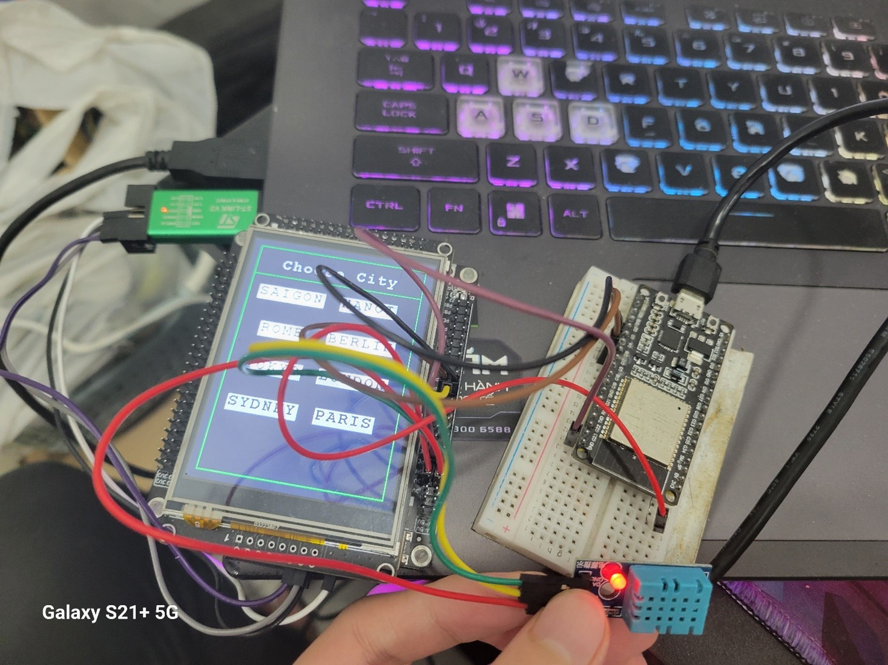
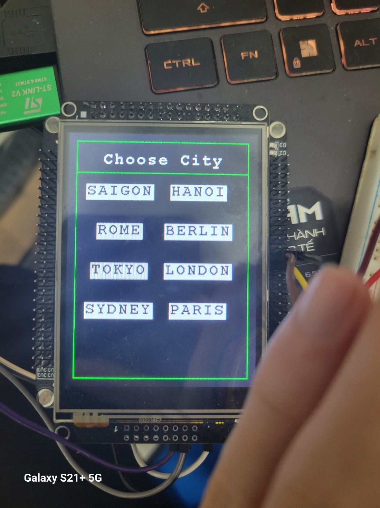
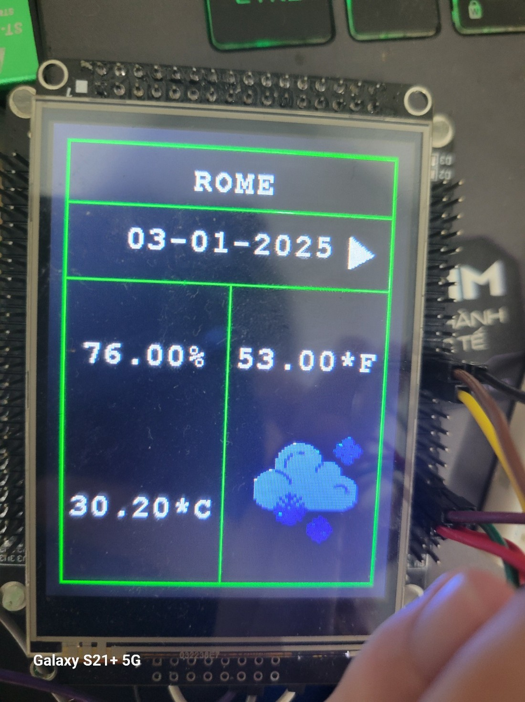
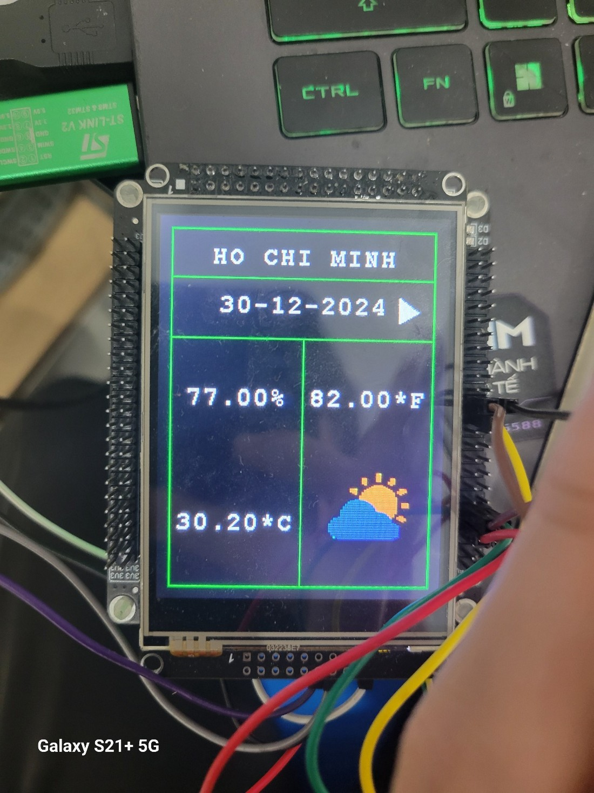

# STM32 weatherstation 

A device that use weatherapi to show weatherforcast

## Hardware Components

- STM32F407VET6 
- LCD ILI9341
- Esp32-wroom-32
- sensor DHT11

## Features

- Measure temperature and humidity using the DHT11 Sensor.
- Interaction and control via touchscreen
- display temperature, humidity, weatherforcast
- communicate with ESP32 via UART protocol
## Code Overview

-	Choose city to start
-   Get information from DHT sensor, UART
-   Display on ILI9341 LCD

## Image of product
Wiring
    
Choose city
  
Rome
  
Ho Chi Minh City
  

